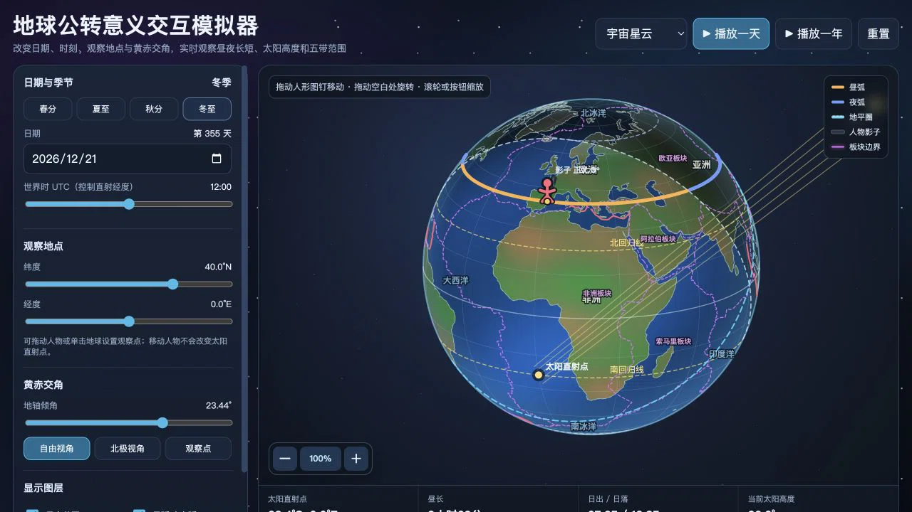
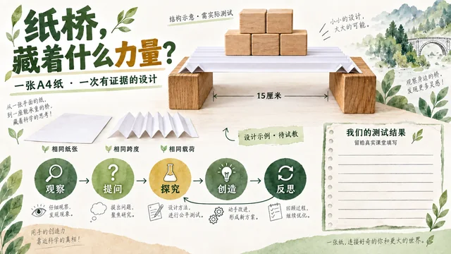

# 他山 · Tashan


**以他山之石，琢教学之玉。**

他山是一个面向教师的教学项目展示、创作与分享平台。你可以发现可视化实验和课堂 Prompt，结合学生的需要继续改编，再把自己的作品整理、保存并分享给其他教师。

[在线体验 · tashan.dev](https://tashan.dev) · [账号与使用说明](docs/ACCOUNTS.md) · [最近验收记录](docs/PERFORMANCE_QA.md)

目前已上线账号管理、云端项目上传与发布、版本和来源记录、备份，以及 DeepSeek 教学文字助手。公开注册暂未开放，账号由管理员创建；也可以通过登录页的「游客模式」浏览公开作品。

## 看看平台里的作品

仓库内置 **14 个精选项目：9 个可视化作品、5 个 Prompt / 教案模板**，配有教学建议、原始资料、来源与验证记录。成员发布的云端作品另行展示。

| 可视化实验 | 古诗词海报 Prompt | 项目式学习设计 |
| --- | --- | --- |
| [](https://tashan.dev/#project/earth) | [](https://tashan.dev/#project/poetry) | [](https://tashan.dev/#project/pbl) |
| 改变参数，观察四季与昼夜变化 | 从诗文出发，组织画面与课堂提问 | 围绕真实问题，设计探究与反馈活动 |

海报是预先生成的展示素材；平台内的 DeepSeek 接口提供文字分析与 Prompt 优化。生成示例、教学建议和「运行已检查」不代表已经完成真实课堂成效验证。

## 可以做什么

| 功能 | 当前支持 |
| --- | --- |
| 发现项目 | 精选轮播、搜索、学科与学段筛选、验证状态、项目详情和原始资料下载 |
| 我的工作台 | 收藏、创作任务、草稿、本地项目、云端版本，以及备份导入与导出 |
| 上传与分享 | 上传可视化 HTML 或其他附件、保存 Prompt、添加封面与教学信息，发布或撤回本人作品 |
| 版本与来源 | 稳定项目编号、不可变版本快照、带版本的来源引用；改编时保留参考项目关系 |
| AI 教学助手 | 分析上传资料并预填八项信息、生成教学建议、优化继续创作的 Prompt；调用入口显示 AI 标识 |
| 账号与个人资料 | 管理员创建、编辑、停用及重置账号；支持学校、机构或个人归属；成员可在个人页主动改密 |
| 管理 AI 提示词 | 按三类功能修改教学指令、恢复默认、查看修改记录，并处理多人编辑冲突 |
| 界面与体验 | 简体中文、繁體中文、English；默认浅色与深色切换；桌面和手机布局；原石登录与凿石见玉动效 |

新建账号使用管理员分配的密码直接登录，无需首次强制改密；管理员重置密码后按重置流程修改。密码至少 8 位，允许纯数字。学校或机构需填写名称，个人无需填写；归属信息不创建共享工作空间。

管理员负责账号与 AI 配置管理，私有项目仍按所有者隔离。成员自行决定公开哪个版本，无需管理员逐项审批。

## 从发现到分享

1. **发现一件作品。** 浏览项目与教学建议，查看来源；可视化 HTML 在隔离预览中运行，Prompt 可查看和复制。
2. **带入自己的课堂。** 登录后收藏项目，或基于已有项目继续创作，调整学生背景、学习目标与使用条件。
3. **整理自己的作品。** 在工作台上传文件或填写 Prompt，添加封面；AI 可以协助补充信息，提交前由本人核对。
4. **保存版本，再决定公开。** 上传到云端后可在其他设备登录读取该版本；明确发布后游客才能访问。后续草稿或新版本不会自动替换已公开版本。

游客可以浏览与体验公开作品。收藏、创作、上传、AI 调用及个人工作台需要登录。

## 数据保存在哪里

| 内容 | 保存位置 |
| --- | --- |
| 草稿、收藏、创作任务、尚未上传的项目及本地历史 | 当前浏览器，按账号隔离 |
| 本机开发账号、服务端项目记录和附件 | `.local/` 中的 SQLite 数据库与私有文件目录 |
| 线上账号、归属资料、项目版本、发布状态、AI 提示词与操作记录 | Supabase Auth / Postgres |
| 线上新上传的附件与封面 | 私有 Cloudflare R2，通过平台 API 授权访问 |
| 界面、服务端代码、迁移脚本、精选项目及展示素材 | 本 Git 仓库 |

**登录不会自动同步整个工作台，明确上传的版本才进入服务端。** 更换浏览器、域名或开发环境前，请先导出尚未上传的资料。旧版 Supabase Storage 文件保留读取兼容，新的 R2 文件按版本记录访问。

### 文件与备份限制

| 项目 | 当前业务上限 |
| --- | ---: |
| 单个项目附件 | 10 MiB |
| 单张封面 | 5 MiB |
| 每账号服务端项目数 | 100 个 |
| 每项目版本数 | 100 个 |
| 每账号服务端用量，含版本资料 | 200 MiB |
| 单份便携备份，按去重后的内容计 | 50 MiB |

这里 `1 MiB = 1,048,576` 字节。实际上传能力由当前服务端配置决定，页面会读取并显示限制。

工作台备份包含导出范围内的项目、文件、草稿、版本、收藏和任务；「备份此项目全部版本」用于本人已上传的单个项目。个人备份不包含账号、密码或会话，也不能代替全站数据库和对象存储备份。完整范围见 [存储与备份](docs/LOCAL_STORAGE.md) 和 [云端配置](docs/CLOUD_SETUP.md)。

### AI 的使用范围

上传分析默认开启，也可在选文件前关闭。当前可以提取 HTML、Markdown、TXT 和 JSON 的教学文字，自动补充空字段；教学建议与 Prompt 优化可以核对后采用。封面、许可、课堂记录与验证确认由本人提供，AI 不会自动保存或公开项目。

ZIP、PDF、Word 和 PowerPoint 可作为附件保存下载，当前不自动解析其中内容；ZIP 不解包运行。AI 不直接生成图片或执行项目代码。调用次数、文字长度与额度等说明见 [DeepSeek 教学助手](docs/AI_ASSISTANT.md)，管理方式见 [AI 提示词配置](docs/AI_PROMPTS.md)。

## 本地运行

需要 **Node.js 22.13 或更新版本、Python 3 和 Git**。

```sh
git clone https://github.com/107843099/tashan.git
cd tashan
npm ci
npm run dev:setup
npm run dev
```

打开 [http://127.0.0.1:4173/](http://127.0.0.1:4173/)。首次 `dev:setup` 按终端提示创建管理员，密码通过隐藏输入设置，仓库没有默认登录凭据。之后运行 `npm run dev` 即可。

本机模式使用 Node 内置 SQLite，无需配置 Supabase 即可测试账号和项目流程。`npm start` 与 `npm run dev` 等效；服务默认仅监听本机。AI 功能需要另行配置服务端密钥，详见 [AI 配置说明](docs/AI_ASSISTANT.md)。

### 使用云端开发配置

按 [云端配置与迁移](docs/CLOUD_SETUP.md) 准备自己的环境，再将 `.dev.vars.example` 复制为 `.dev.vars` 并填写服务端配置：

```sh
npm run cloud:check
npm run dev:cloud
```

`.dev.vars`、`.local/` 与真实用户数据不随 Git 克隆或同步。Node 的云开发模式使用 Supabase，但不具备 R2 binding；读取已保存到 R2 的版本应使用配置正确 binding 的 Worker 环境。连接真实云环境时，账号与项目操作会写入该环境。

## 构建与部署

```sh
npm run build
npm run preview
```

构建生成 `dist/` 和 `releases/tashan-site.zip`，ZIP 根目录为 `index.html`。打开 [http://127.0.0.1:4174/](http://127.0.0.1:4174/) 可检查静态发布内容；这个预览没有账号 API。日常修改源码后重新构建，不直接编辑生成目录。

完整线上平台使用 **Cloudflare Workers + Supabase + 私有 R2**。部署到自己的环境时：

1. 按顺序应用 `supabase/migrations/` 中的迁移，当前到 **007**；已有环境只执行尚未应用的增量。
2. 配置 Supabase Auth、私有存储、首次管理员，以及 `wrangler.jsonc` 中的项目地址、R2 binding、上传限制与域名。
3. 将 `SUPABASE_SECRET_KEY`、`DEEPSEEK_API_KEY` 等服务端密钥配置为 Workers Secrets，完成云端预检。
4. 构建后运行 `npx wrangler deploy`，再在目标域名检查登录、上传、下载和发布流程。

单独上传静态 ZIP 只提供展示文件，不会创建账号数据库或开通云端上传。密钥不写入前端和公开仓库。完整操作见 [构建与部署](docs/DEPLOYMENT.md)。

## 验证与近期优化

当前版本已验证账号与权限、上传和固定版本发布、撤回、备份、AI 自动分析，以及三语、明暗和移动端布局。正式域名最近一轮公开验收 **121/121 通过**，实际 DeepSeek 调用和云端文件完整性另行验证。

另已通过正式站界面完成管理员新建成员、该成员上传与发布重力作品和古诗 Prompt，并用全新浏览器空间及游客回读验证；详见 [新账号上传与分享验收](docs/SHARING_UI_QA.md)。

- 登录表单优先显示；已有账号或游客会话刷新不重复加载三维入口。
- 玉璧保持正圆，场景分阶段初始化、支持取消清理；闲置降低绘制频率，隐藏页面停止动画。
- 5 张示例图提供 320 / 640 / 960 尺寸预览，默认预览总量减少约 **97%**，原 PNG 与来源哈希保留。
- 深浅色切换保留正在填写的内容；资源版本随构建更新。

测试条件、结果与性能样本见 [加载优化验收](docs/PERFORMANCE_QA.md)。这些记录描述已执行的测试范围，不代表所有设备或课堂环境。

```sh
npm test
npm run test:worker-storage
npm run test:browser
npm run verify:live -- --origin https://tashan.dev
```

完整数据库测试需准备 PGlite，浏览器测试需准备 Playwright 和浏览器；可通过 `PGLITE_MODULE`、`PLAYWRIGHT_MODULE` 指定模块路径，使用已安装的 Chrome 时设置 `BROWSER_CHANNEL=chrome`。缺少可选依赖而跳过的测试不计为完整验收。`verify:live` 只检查公开资源与匿名访问，不登录、上传或调用 AI 生成。

## 项目结构与文档

```text
index.html              主界面入口
project-preview.html    上传项目的隔离预览入口
assets/                 样式、脚本、图标、展示图与浏览器资源
data/                   精选目录、翻译、来源与图片变体记录
server/                 账号、项目与 AI API；本机和 Worker 运行入口
supabase/migrations/    云端数据库迁移
scripts/                开发、构建、云配置与验收工具
tests/                  数据、接口、浏览器与运行环境测试
docs/                   使用、部署、设计及验收说明
vibe coding库/          精选项目的原始资料
archive/                历史原型与说明
```

`dist/`、`releases/`、`.local/` 和私有配置不纳入 Git。旧版 HTML 地址保留兼容跳转，新链接统一使用主入口。

| 需要了解 | 文档 |
| --- | --- |
| 账号、个人资料与管理员操作 | [账号使用与配置](docs/ACCOUNTS.md) |
| AI 分析与管理员提示词 | [AI 助手](docs/AI_ASSISTANT.md) · [提示词管理](docs/AI_PROMPTS.md) |
| 云端配置、迁移与系统备份 | [云配置](docs/CLOUD_SETUP.md) · [部署说明](docs/DEPLOYMENT.md) |
| 本地项目与资料维护 | [内容目录](docs/LOCAL_LIBRARY.md) · [存储备份](docs/LOCAL_STORAGE.md) |
| 来源、教学建议与生成示例 | [教学参考](docs/TEACHING_REFERENCES.md) · [示例记录](docs/PROMPT_IMAGE_EXAMPLES.md) |
| 页面体验与近期验收 | [入场动效](docs/TASHAN_ENTRANCE.md) · [性能验收](docs/PERFORMANCE_QA.md) · [AI 管理验收](docs/ADMIN_AI_QA.md) |
| 目录设计与后续规划 | [项目结构](docs/PROJECT_STRUCTURE.md) · [下一版本](docs/NEXT_VERSION.md) |

原始作品保留来源记录与作者信息，素材的使用许可按各项目说明核对；第三方依赖保留其随附许可。
